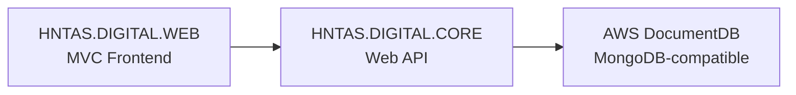

# HNTAS Digital Web (`HNTAS.DIGITAL.WEB`)

## Overview
The HNTAS Digital Service is a unified platform designed to manage, submit, and validate heat network data in line with regulatory requirements.

---

## ⚙️ Technology Stack

| Layer | Technology |
| :--- | :--- |
| **Runtime** | .NET 10, C# |
| **Web Framework** | ASP.NET Core MVC |
| **UI Rendering** | Razor Pages / Razor Views |


### 🧱 High-level Architecture




## Purpose
The service supports:
- Compliance with heat network regulations.
- Submission and validation of KPI data.
- Monitoring and assurance of heat network performance.


## Running Locally

### Prerequisites
- .NET 10 SDK
- Backend API running


## Getting Started

Clone the repository and restore dependencies from the root directory:


```bash
git clone <repository-url>
cd hntas-digital-web/HNTAS
dotnet restore
```

### Run Web App
```bash
cd HNTAS.Web.UI
dotnet run --launch-profile https
```

---

## Application URL
- Example: `https://localhost:7239`

---


